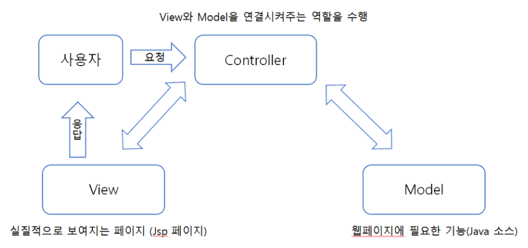

# MVC

소프트웨어 설계에서 세 가지 구성 요소인 Model, View, Controller를 이용한 설계 방식을 말한다.

Model은 소프트웨어 내에서 데이터를 의미하고, View는 사용자에게 보이는 화면 내용을 의미한다. 이러한 Model과 View의 상호작용을 관리하는 것이 Controller이다.

따라서 MVC란 Model, View, Controller 의 합성어로 소프트웨어 공학에서 사용되는 소프트웨어 디자인 패턴이다.

1.  Model : 백그라운드에서 동작하는 로직을 처리
2.  View : 사용자가 보게 될 결과 화면을 출력
3.  Controller : 사용자의 입력처리와 흐름 제어를 담당

예를 들어, 사용자의 입력이 Controller로 들어오면 Controller는 Model에서 데이터를 불러오고, 해당 데이터를 View를 통해 화면으로 출력한다. Model, View, Controller가 기능별로 독립적으로 분리되어 있어서 여러 명의 개발자가 동시에 각각의 기능을 개발할 수 있고, 일부 기능이 추가될 경우도 기존의 구성 요소를 재사용할 수 있어 코드 재사용성이 향상된다.

## Model

애플리케이션의 정보, 데이터의 가공을 책임지며 DB와 상호작용하며 비즈니스 로직을 처리하는 모듈, 컴포넌트를 말한다.

Model은 아래와 같은 규칙을 가지고 있다.

-   **사용자가 이용하려는 모든 데이터를 가지고 있어야한다.**

    화면안의 네모박스에 글자가 표현된다면, 네모박스의 화면 위치 정보, 네모박스의 크기정보, 글자내용, 글자의 위치, 글자의 포맷 정보 등을 가지고 있어야 한다.

-   **View 또는 Controller에 대해 어떤 정보도 알 수 없어야 한다.**

    데이터 변경이 일어났을 때 모델에서 화면 UI를 직접 조정해서 수정할 수 있도록 뷰를 참조하는 내부 속성값을 가지면 안 된다.

-   **변경이 일어나면 처리 방법을 구현해야 한다.**

    모델의 속성 중 텍스트 정보가 변경이 된다면, 이벤트를 발생시켜 누군가에게 전달해야 하며, 누군가 모델을 변경하도록 요청하는 이벤트를 보냈을 때 이를 수신할 수 있는 처리 방법을 구현해야 한다. 또한 모델은 재사용가능해야 하며 다른 인터페이스에서도 변하지 않아야 한다.

## View

사용자 인터페이스 요소를 뜻하는데, Client 에게 보여지는 결과화면을 반환하는 모듈을 말한다.

View는 아래와 같은 규칙들을 가지고 있다.

-   **Model이 가지고 있는 데이터를 저장하면 안된다.**

    화면에 글자를 표시하기 위해 모델이 가지고 있는 정보를 전달받게 되는데, 그 정보를 유지하기 위해서 임의의 View 내부에 저장하면 안된다.

    단순히 네모 박스를 그리라는 명령을 받으면, 화면에 표시하기만 하고 그 화면을 그릴 때 필요한 정보들은 저장하면 안된다.

-   **Model이나 Controller에 대한 정보를 알면 안되며 단순히 표시해주는 역할만 해야한다.**

    Model과 마찬가지로 자기 자신의 요소가 아닌 다른 요소는 참조하거나 어떻게 동작하는지 알아서는 안된다. 뷰는 데이터를 받으면 화면에 표시해주는 역할만 가진다고 보면 된다.

-   **변경이 일어나면 처리 방법을 구현해야 한다.**

    Model과 마찬가지로 변경이 일어났을 때 이를 누군가에게 변경을 알려주기 위한 방법을 구현해야 한다. View는 화면에서 사용자가 화면에 표시된 내용을 변경하게 되면 이를 모델에게 전달해서 모델을 변경해야 한다. 그 작업을 하기 위해 변경 통지를 구현해야 한다.

    그리고 재사용이 가능하게 설계를 해야 하며 다른 정보들을 표현할 때 쉽게 설계해야 한다.

## Controller

Client의 요청이 들어왔을 때 그 입력을 처리하고 어떤 로직을 실행시킬 것인지 Model과 View를 연결해주며 제어하는 모듈을 말한다.

Controller는 아래와 같은 규칙들을 가지고 있다.

-   **Model 또는 View에 대한 정보를 알아야 한다.**

    Model이나 View는 서로의 존재를 모르고, 변경을 외부로 알리고, 수신하는 방법만 가지고 있는데 이를 컨트롤러가 중재하기 위해 모델과 그에 관련된 뷰에 대해서 알고 있어야 한다.

-   **Model 또는 View의 변경을 인지하여 대처해야 한다.**

    Model이나 View의 변경 통지를 받으면 이를 해석해서 각각의 구성 요소에게 통지를 해야한다. 또한, 애플리케이션의 메인 로직은 컨트롤러가 담당하게 된다.

## Model 1

Model1 구조는 사용자의 요청을 JSP가 전부 다 처리하는 방식이다. 클라이언트의 요청을 받은 JSP는 자바빈이나 서비스 클래스를 사용하여 웹브라우저가 요청한 작업을 처리하고 그 결과를 출력해준다.

## Model 2

Model1 구조와 달리 웹 브라우저 사용자의 요청을 서블릿이 받는다. 서블릿은 웹브라우저의 요청을 받아 View로 보여줄것인지 Model로 보내줄 것인지 정하여 전송해준다. 여기서 View페이지는 사용자에게 보여주는 역할만 담당하고 실질적인 기능의 부분은 Model에서 담당한다.

Model2 방식의 경우 실질적으로 보여지는 HTML과 JAVA 소스를 분리 해놓았기 때문에 Model1방식에 비해 개발을 확장시키기도 쉽고 유지보수하기도 쉽다.