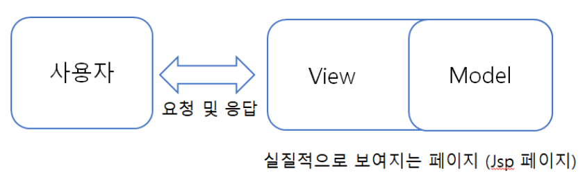
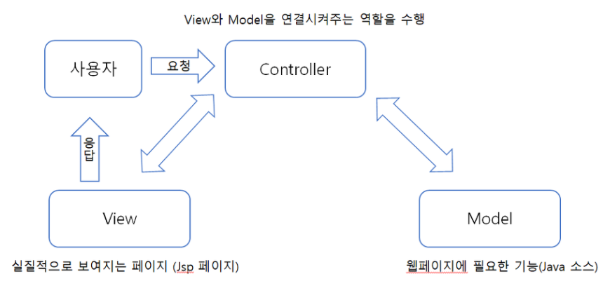

# MVC

소프트웨어 설계에서 세 가지 구성 요소인 Model, View, Controller를 이용한 설계 방식을 말한다.

Model은 소프트웨어 내에서 데이터를 의미하고, View는 사용자에게 보이는 화면 내용을 의미한다. 이러한 Model과 View의 상호작용을 관리하는 것이 Controller이다.

따라서 MVC란 Model, View, Controller 의 합성어로 소프트웨어 공학에서 사용되는 소프트웨어 디자인 패턴이다.

1.  Model : 백그라운드에서 동작하는 로직을 처리
2.  View : 사용자가 보게 될 결과 화면을 출력
3.  Controller : 사용자의 입력처리와 흐름 제어를 담당

예를 들어, 사용자의 입력이 Controller로 들어오면 Controller는 Model에서 데이터를 불러오고, 해당 데이터를 View를 통해 화면으로 출력한다. Model, View, Controller가 기능별로 독립적으로 분리되어 있어서 여러 명의 개발자가 동시에 각각의 기능을 개발할 수 있고, 일부 기능이 추가될 경우도 기존의 구성 요소를 재사용할 수 있어 코드 재사용성이 향상된다.

## Model1

Model1 구조는 사용자의 요청을 JSP가 전부 다 처리하는 방식이다. 클라이언트의 요청을 받은 JSP는 자바빈이나 서비스 클래스를 사용하여 웹브라우저가 요청한 작업을 처리하고 그 결과를 출력해준다.

## Model2

Model1 구조와 달리 웹 브라우저 사용자의 요청을 서블릿이 받는다. 서블릿은 웹브라우저의 요청을 받아 View로 보여줄것인지 Model로 보내줄 것인지 정하여 전송해준다. 여기서 View페이지는 사용자에게 보여주는 역할만 담당하고 실질적인 기능의 부분은 Model에서 담당한다.

Model2 방식의 경우 실질적으로 보여지는 HTML과 JAVA 소스를 분리 해놓았기 때문에 Model1방식에 비해 개발을 확장시키기도 쉽고 유지보수하기도 쉽다.