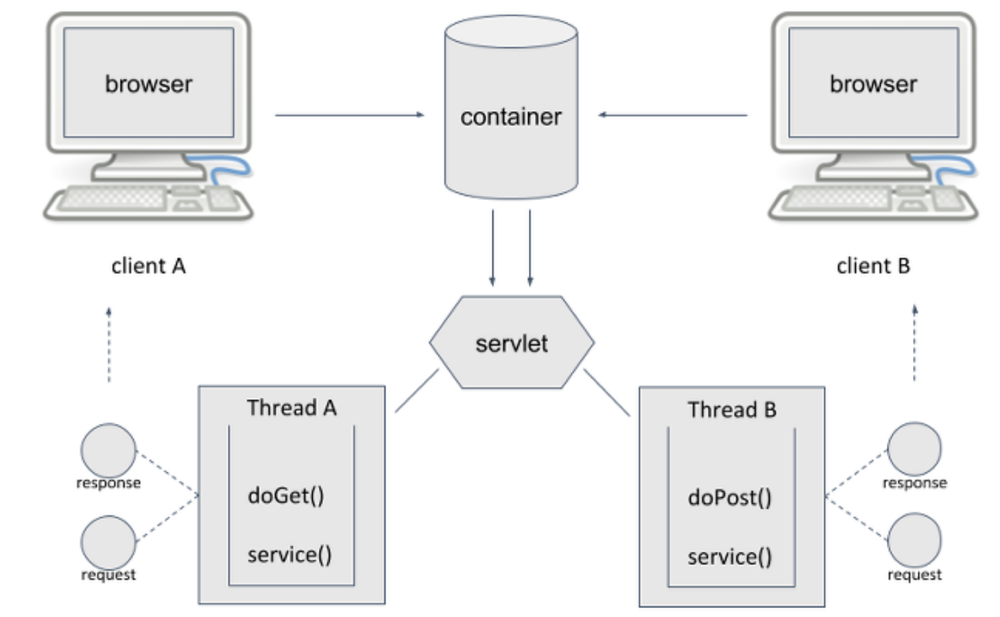

# Servlet의 동작 구조


## Servlet의 구조

서블릿은 자바 웹 프로그램이다. 일반적인 웹 서버의 주된 기능은 웹 페이지를 클라이언트로 전달하는데에 있다. 주로 정적인 페이지를 제공하는 역할을 하는데, 이 역할만으론 실시간으로 작성된 페이지를 제공하거나, 서버상에 데이터를 저장할 수 없다. 따라서 이런 역할을 해 주는 다른  도우미 애플리케이션이 필요하다.

이런 도우미 애플리케이션을 사용하면 웹 서버는 도우미 애플리케이션에 요청을 전달하기만 한다. 그러면, 도우미 애플리케이션은 요청받은 작업을 수행하거나 정적인 페이지를 만들어서 웹서버로 전달한다. 웹서버는 이를 다시 클라이언트로 전해준다.

자바에서 이 역할을 해 주는 것이 서블릿이다


서블릿 또한 웹 서버의 요청을 바로 수행할 수 있는게 아니다. 서블릿도 도움이 필요한데, 예를들어 요청이 들어오면 누군가 요청을 처리할 새로운 스레드를 만들어줘야 하고 서블릿에서 필요한 메소드를 호출해야 한다. 또한 파라미터로 받은 값을 넘겨주기도 해야 한다. 이 역할을 하는 것이 바로 컨테이너이다.


따라서 서블릿 환경에서 클라이언트가 서버에게 요청을 하고 응답을 받기까지의 과정이 위의 그림과 같다


​	***클라이언트 <=> 웹서버 <=> 컨테이너 <=> 서블릿***


-   ### 컨테이너

    ---

    

    컨테이너는 사용자로부터 요청을 받을 때 마다 요청을 처리할 쓰레드를 생성한다.

    그리고 그 쓰레드에서 필요한 서블릿 메소드를 호출하게 된다. 그렇다고 해서 쓰레드를 무제한으로 생성하는게 아니라, 컨테이너 내부에 쓰레드풀에 스레드를 저장하고, 필요할 때 꺼내 사용하게 된다.

    요청이 올 때 마다 쓰레를 새로 생성하거나 쓰레드 풀에서 꺼내 쓰는 것이지, 서블릿 인스턴스를 새로 생성하는건 아니다.

    

    -   #### 동작방식

        

        1.  클라이언트가  URL을 통해 요청을 보내면 HTTP Requset를 Servlet Container로 전송한다.
        2.  HTTP Rquest를 전송받은 Servlet Container는 HttpServletRequest, HttpServletResponse 두 객체를 생성한다.
        3.  요청한 URL을 분석하여 어느 서블릿에 대해 요청한 것인지 찾는다.
        4.  해당 서블릿에서 service메소드를 호출한 후 POST, GET 여부에 따라 doGet() 또는 doPost()를 호출한다.
        5.  doGet() or doPost() 메소드는 동적 페이지를 생성한 후 HttpServletResponse객체에 응답을 보낸다.
        6.  응답이 끝나면 HttpServletRequset, HttpServletResponse 두 객체를 소멸시킨다.

        

        여기서 HttpServletRequest, HttpServletResponse 객체를 생성한 컨테이너는 요청에 알맞은 서블릿을 찾게 되는데 이 서블릿을 찾기 위해서는 개발자가 서블릿을 매핑해줘야 한다. 그렇지 않으면 적절한 서블릿을 찾을 수 있는 정보가 없기때문에 컨테이너는 서블릿을 찾지 못하게 된다.

         

    서블릿을 매핑하는 방법은 몇 가지가 있는데 가장 많이 쓰이는 것은 배포서술자를 사용하거나 어노테이션을 이용하는 매핑방법이다.

    

    -   #### 배포서술자 (Deployment Descriptor)

        web.xml 파일을 통해 <web-app>태그 내부에 서블릿을 정의한다. <servlet>태그 안에 등록된 서블릿들이 컨테이너가 관리하는 서블릿을 의미한다. 이 때, <servlet-name>은 실제 클래스명이나 호출한 URL 이름과는 다르다. 실제 클래스는 패키지와 함께 <servlet-class>에 작성해준다.

        또한 <servlet-mapping>을 통해 클라이언트에서 URL을 통해 요청받은 이름과 <servlet-name>을 매핑하게 되는데 이 때 <servlet-name>은 <servlet>태그의 <servlet-name>과 같은 이름을 가져야 한다.


        이렇게 배포서술자를 이용하면 하나의 서블릿이 세가지의 이름을 가지게 된다. 이렇게 함으로서 유연성, 보안성이 증대되는 효과를 얻을 수 있다. 클래스의 위치나 이름이 바뀌었을 때 배포서술자의 해당 부분만 바꿔주면 쉽게 수정할 수 있고, 클라이언트에 실제 클래스 위치를 숨겨주기 때문에 보안성이 증대된다고 볼 수 있다.

        단순히 서블릿을 매핑하는 용도 외에도 배포서술자를 통해 웹 앱에 필요한 다양한 정보를 서술할 수 있다. 배포서술자를 활용했을 때 가장 큰 장점은 작성한 소스코드를 바꾸지 않고 중요한 부분을 수정할 수 있다는 점이다.

        ``` xml
        <web-app xmlns="http://xmlns.jcp.org/xml/ns/javaee"
          xmlns:xsi="http://www.w3.org/2001/XMLSchema-instance"
          xsi:schemaLocation="http://xmlns.jcp.org/xml/ns/javaee
                              http://xmlns.jcp.org/xml/ns/javaee/web-app_4_0.xsd"
          version="4.0"
          metadata-complete="true">
            <servlet>
                <servlet-name>name</servlet-name>
                <servlet-class>Test</servlet-class>
            </servlet>
        
            <servlet-mapping>
                <servlet-name>name</servlet-name>
                <url-pattern>/hello</url-pattern>
            </servlet-mapping>
        
          <display-name>Welcome to Tomcat</display-name>
          <description>
             Welcome to Tomcat
          </description>
        
        </web-app>
        ```

        

    -   #### Annotation

        서블릿 초기 표준에는 이 배포서술자가 반드시 필요했지만 servlet 3.0부터는 Annotation을 지원하게 되면서 배포서술자 없이도 서블릿 매핑이 가능하게 되었다. 어노테이션의 장점은 역시 편의성에 있다. 한줄의 코드로 매핑을 할 수 있기 때문에 복잡한 배포서술자의 xml태그를 거치지 않아도 된다.

        ``` java
        @WebServlet("/myservlet")
        public class MyServlet extends HttpServlet {
            @Override
            protected void doGet(HttpServletRequest request, HttpServletResponse response)
                throws ServletExceptionm IOException {
                printWriter out = response.gerWriter();
                out.println("<html>" +
                           		"<body>" +
                           			"<h1 align=center>Helloworld!</h1>" +
                           		"</body>" +
                           	"</html>");
            }
        }
        ```

        

-    ## Servlet lifecycle

    -   servlet의 동작 순서
        1.  클라이언트에서 HTTP Request 발생
        2.  Servlet에 관한 요청이면 Web Server가 servlet이 배포(deploy)된 컨테이너에게 요청을 넘김
        3.  컨테이너는 HttpServletRequest, HttpServletResponse 객체를 생성
        4.  배포서술자(DD)나 annotation을 통해 요청 URL과 매핑된 서블릿을 파악
        5.  새로운 thread를 생성하거나 thread pool에 있는 thread를 이용해 해당 servlet의 service() method호출
        6.  service() method를 호출 할 때 arguments로 HttpServletRequest, HttpServletResonse를 넘김
        7.  service() method는 요청문에서 지정한 HTTP method에 따라 doGet(), doPost(), doDelete() 등의 method를 호출
        8.  service()에서 다른 method를 호출할 때 parameter로 받은 HttpServletRequestm HttpServletResponse를 arguments로 넘김
        9.  해당 method는 HttpServletRequest 객체를 통해 전달받은 parameter를 이용해 작업 수행
        10.  해당 method는 HttpServletResponse 객체에 응답을 쓰고(write) 종료
        11.  HttpServletResponse에 담긴 응답은 Web Server를 통해 Client로 보내짐
        12.  service() method가 종료되고 나면 해당 thread는 소멸되거나 thread pool로 보내짐
        13.  HttpServletRequest, HttpServletResponse 두 객체는 Grabage Collection의 대상이 됨.


    위의 동작 순서에서 컨테이너는 매핑된 서블릿을 찾아서 service() 메소드를 호출한다 하였는데, 어떤 클래스의 메소드를 호출하려면 그 클래스의 instance가 존재해야 한다. 그렇다면 servlet의 instance가 언제 생성될까?

    

    

    servlet의 instance는 클라이언트로 부터 최초 요청을 받았을 때 생성된다.

    컨테이너는 client의 최초 요청이 있을 때, 매핑된 servlet 클래스 파일을 찾아서 로딩하게 된다. 그리고 servlet 객체를 생성하고 초기화를 담당하는 init() method를 호출하게 된다.

    하지만 이렇게 컨테이너에 최초 요청이 들어올 때 클래스를 로드하고 생성자와 초기화 메소드를 호출하게 되면 최초에 접속하는 클라이언트는 시간적으로 손해를 보게 된다. 또 개발자가 먼저 로드시키고 싶은 서블릿 클래스가 존재할 수도 있다.

    그런 경우에 load-on-startup이라는 요소를 사용할 수 있다. 배포 서술자나 어노테이션을 통해 이 값을 0보다 큰 양의 정수로 지정하게 되면 컨테이너가 처음 시작할 때(웹 어플리케이션 배포시) 이 값의 순서대로 servlet 클래스가 로드되게 된다.

    ``` xml
    <servlet>
        <servlet-name>servlet</servlet-name>
        <servlet-class>classpath.servlet</servlet-class>
        <load-on-startup>1</load-on-startup>
    </servlet>
    ```

    이렇게 <servlet-class>아래에 <load-on-startup>을 추가해주거나

    ``` java
    @WebServlet(
    	urlPatterns = "/myController",
    	loadOnStartup = 1
    )
    ```

    이런식으로 애너테이션에 loadOnStartup을 추가해준다.

    

    

    이렇게 클래스가 로드되고 생성자를 호출해서 servlet class의 객체(object)를 생성했다. 그러나 서블릿이 만들어 질 때 반드시 수행되어야 하는 작업이 있을 수 있다. 가령 초기화 같은 것 말이다. 사실 지금 상태의 servlet instance는 컨테이너로부터 서블릿 설정정보나 웹 애플리케이션 설정 정보를 읽어올 수조차 없다. 그래서 컨테이너는 instance 생성 이후에 init() method를 호출해 해당하는 servlet을 초기화시킨다. 개발자는 이 init() method를 override 해서 서블릿 최초 생성시에 필요한 코드를 작성할 수 있다. 이 때 init() method는 ServletConfig 라는 객체를 인자로 받는다. ServletConfig객체는 Servlet과 웹 어플리케이션 설정정보를 담고있는 객체이다.

    

    

    

    초기화가 된 서블릿은 이제 컨테이너에서 전달되는 요청이 있을 때 service() method가 호출된다. service() method는 request 요청에 알맞은 method 가령 doGet()이나 doPost()같은 method를 찾아서 호출한다. 그리고 웹 애플리케이션이 종료되거나 서블릿이 오랜기간 사용되지 않으면 컨테이너는 서블릿을 소멸시키게 되는데 이 때 호출되는 것이 destroy() method 이다. 이 method에는 servlet이 종료될 때 필요한 작업을 override 할 수 있다.

    

    ---

    

    

    

    Servlet은 최초 요청이 있을 때 그 instance를 생성하고, 컨테이너는 요청마다 새로운 thread를 만들거나 thread pool에서 thread를 가져와서 service() method를 호출한다. 새로운 servlet instance를 만드는게 아니다. 만약 같은 서블릿에 대한 두가지 요청이 동시에 발생했을 경우

    1.  client 두 곳에서 요청이 들어옴
    2.  컨테이너는 2개의 thread를 생성하고 각각의 thread에서 request객체와 response객체를 생성
    3.  mapping된 servlet에 service() 메소드를 호출

    

    

    

    

    

    


